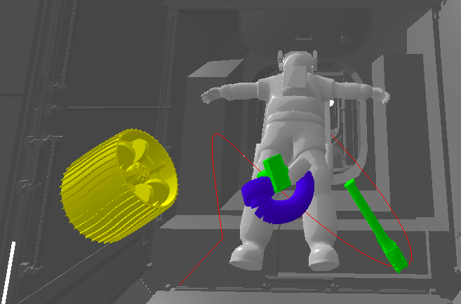
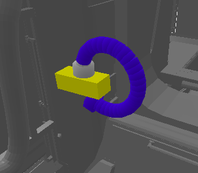
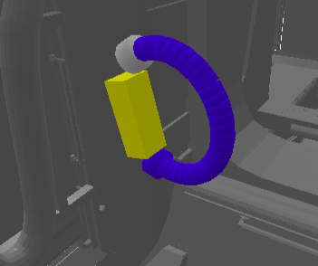
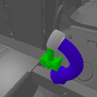

# FLOATS: Flexible Light-weight On-orbit Actuator Simulation

A simulation framework for free-flying soft robots in microgravity.

---

## About the Project
FLOATS facilitates realistic simulation of locomotion, manipulation, and planning for deformable on-orbit systems.
We demonstrate grasping, free-floating object reconfiguration, and mobile manipulation tasks as a baseline for research on soft robotics planning and control in microgravity.



## Features
- **PyBullet Simulation Environment**:
  - Loads ISS environment and mission objects.
- **Manipulator Control**:
  - Load and configure a soft continuum manipulator.
  - Apply torque control and set contact properties.
- **Path Planning Algorithms**:
  - RRT
  - RRT*
  - RRT-Connect
  - A* search 
- **Grasping Strategies**:
  - Apply hard-coded trajectories for inhand-manipulation, 
  - Execute torque-based grasps with dynamic adjustments.


## Getting Started

  ### Test inhand manipulation 
  You can perform inhand manipulation by grasping a cargo transfer bag and rotating it by 180 or 360 degrees. The procedure consists of three phases: grasping, releasing with induced
  spin, and timed regrasping. Therefore, we use a trajectory defined in "trajectory_inhand_manipulation", that you can adapt to also manipulate different objects.

       
  
  ```bash
  python test_inhand_manipulation.py
  ```

  ### Test grasping 
  We provide a grasping benchmark with six space-relevant objects. These include a camera, a cargo transfer bag, a sample tube, a rover wheel, a grease gun, and a crew bag. However, only cargo transfer   bag, rover wheel and crew bag can be grasped sucessfully from all six directions.

   
  
  ```bash
  python test_grasping.py
  ```

  ### Test path planning 
  We simulate module-to-module transfer of a camera from the Kibo ELM-PS module to the Cupola module. The experiment allows for four standard planning algorithms: A*, RRT, RRT*, and RRT-Connect.

   
  
  ```bash
  python test_planning.py
  ```


### Prerequisites
```bash
SOMO: https://github.com/GrauleM/somo.git

Ubuntu 16.04 and Ubuntu 18.04 with Python 3.6.9
Ubuntu 20.04 with Python 3.6.9, 3.7.9 and 3.8.2
Windows 10 with Python 3.7 through Anaconda

```
